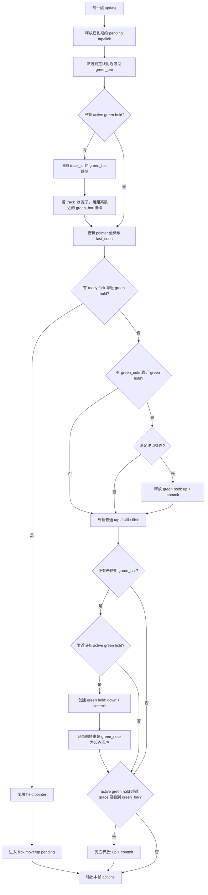

```mermaid
flowchart TD
    A[每一帧 update] --> B[释放已到期的 pending tap/flick]
    B --> C[筛选判定线附近可见 green_bar]
    C --> D{已有 active green hold?}

    D -- 有 --> E[用同 track_id 的 green_bar 跟随]
    E --> F[若 track_id 变了，用距离最近的 green_bar 接续]
    F --> G[更新 pointer 坐标与 last_seen]

    D -- 无 --> G

    G --> H{有 ready flick 靠近 green hold?}
    H -- 是 --> I[复用 held pointer]
    I --> J[进入 flick move/up pending]
    J --> Z[输出动作]

    H -- 否 --> K{有 green_note 靠近 green hold?}
    K -- 否 --> N
    K -- 是 --> L{满足终点条件?}

    L -- 否 --> N
    L -- 是 --> M[释放 green hold: up + commit]
    M --> N

    N[处理普通 tap / skill / flick] --> O{还有未使用 green_bar?}
    O -- 是 --> P{附近没有 active green hold?}
    P -- 是 --> Q[创建 green hold: down + commit]
    Q --> R[记录同帧重叠 green_note 为起点回声]
    P -- 否 --> S
    O -- 否 --> S

    R --> S{active green hold 超过 grace 没看到 green_bar?}
    S -- 是 --> T[兜底释放: up + commit]
    S -- 否 --> Z
    T --> Z[输出本帧 actions]

```